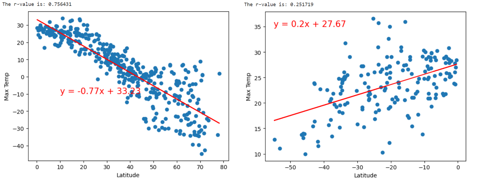
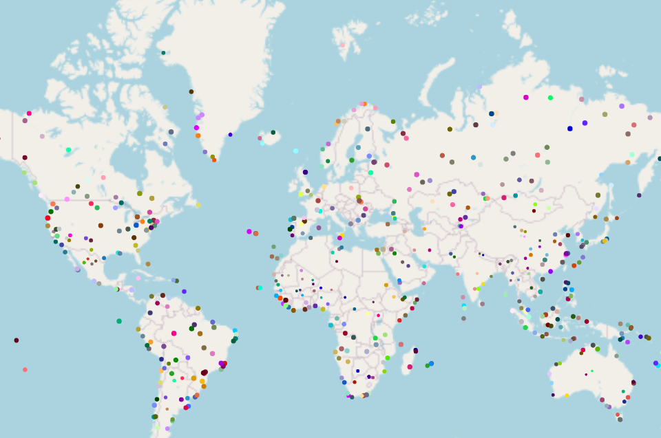

# Python API 

This project is a Python-based analysis of weather data and vacation planning using APIs, JSON traversals, and Python libraries. The goal is to visualize weather patterns across cities and assist in vacation decision-making based on specific weather conditions.

The project is divided into two parts: WeatherPy and VacationPy.

## WeatherPy

In WeatherPy, the aim is to visualize the weather of over 500 cities at varying distances from the equator. The following steps were involved:

1. Utilized the `citipy` Python library and the OpenWeatherMap API to generate random geographic coordinates and find the nearest city for each latitude and longitude combination.
2. Retrieved weather data using the OpenWeatherMap API, including temperature, humidity, cloudiness, and wind speed.
3. Created scatter plots to showcase the relationship between weather variables and latitude.
4. Computed linear regression for each relationship and separated the plots into Northern and Southern Hemispheres based on latitude.

### Sample Scatter Plot with Linear Regression
Northern Hemisphere(Left) Southern Hemisphere(Right)

## VacationPy

VacationPy focuses on utilizing weather data for vacation planning. The key steps undertaken were:

1. Leveraged Jupyter notebooks, the GeoViews    Python library, and the Geoapify API for map visualizations.
2. Created a map displaying city points from the `city_data_df` DataFrame, where the size of each point corresponds to the humidity level.
3. Filtered the `city_data_df` DataFrame based on specific weather conditions to narrow down vacation options.
4. Used the Geoapify API to find hotels located within 10,000 meters of each city's coordinates.
5. Created a new DataFrame, `hotel_df`, to store city, country, coordinates, and humidity information.
6. Enhanced the map visualization by incorporating hotel names and countries as hover information for each city.

### Humidity Map

## Technologies Used

- Python
- Jupyter Notebook
- `citipy` Python library
- OpenWeatherMap API
- GeoViews Python library
- Geoapify API

## Results and Observations

- WeatherPy: The scatter plots demonstrated the relationships between latitude and various weather variables. The linear regression analysis provided insights into the correlation between latitude and temperature, humidity, cloudiness, and wind speed. Detailed observations and findings can be found in the code comments and markdown cells of the `WeatherPy.ipynb` notebook.
- VacationPy: The map visualization showcased city points with varying humidity levels. By applying weather condition filters, suitable vacation destinations were identified. Hotel information was integrated into the map, enabling users to make informed decisions about their preferred vacation spots.

## Conclusion

The Python API Challenge allowed for the practical application of Python programming skills in data retrieval, visualization, and analysis. It demonstrated proficiency in working with APIs, leveraging external libraries, and drawing insights from weather data. The project provides a solid foundation for further exploration and expansion in the realm of data-driven decision-making.
